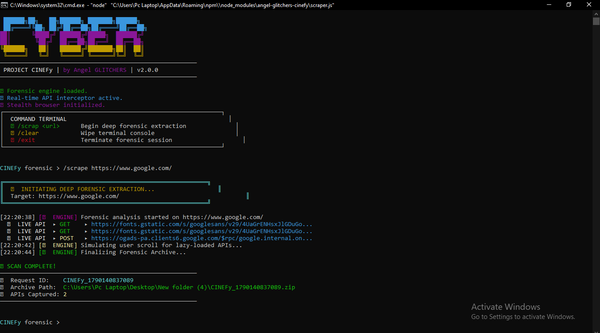

<div align="center">


 ██████╗██╗███╗   ██╗███████╗███████╗██╗   ██╗
██╔════╝██║████╗  ██║██╔════╝██╔════╝╚██╗ ██╔╝
██║     ██║██╔██╗ ██║█████╗  █████╗   ╚████╔╝ 
██║     ██║██║╚██╗██║██╔══╝  ██╔══╝    ╚██╔╝  
╚██████╗██║██║ ╚████║███████╗███████╗   ██║   
 ╚═════╝╚═╝╚═╝  ╚═══╝╚══════╝╚══════╝   ╚═╝   

ADVANCED WEB & API FORENSIC SCRAPER
### **Advanced Web & API Forensic Scraper**


<br>

[](https://github.com/)
[](https://python.org/)

</div>


<p align="center">
  
</p>

[](https://www.npmjs.com/package/angel-glitchers-cinefy)
[](https://opensource.org/licenses/ISC)
[](https://nodejs.org/)
[](https://github.com/berstend/puppeteer-extra/tree/master/packages/puppeteer-extra-plugin-stealth)

**PROJECT CINEFy** by **Angel GLITCHERS** is an interactive, high-performance CLI forensic engine built for deep extraction, real-time API sniffing, network request interception, lazy-load scrolling automation, and full-page visual evidence archive generation.

---

## ⚡ Installation

Install the package globally via npm:

```bash
npm install -g angel-glitchers-cinefy
```

---

## 🚀 Quick Start & Usage

Once installed globally, **PROJECT CINEFy** can be launched from **any terminal or command prompt window, anywhere on your system**, simply by typing:

```bash
angel-glitchers-cinefy
```

> [!IMPORTANT]
> ### 📁 Folder-Specific Command Prompt Recommended!
> **PROJECT CINEFy** automatically saves extracted forensic reports, full-page screenshots, HTML source dumps, and JSON network intelligence as `.zip` archives **directly inside the working directory** where the command is executed.
> 
> For optimal organization and project tracking:
> 1. Open your Command Prompt (CMD) or Terminal inside your desired target project folder.
> 2. Run `angel-glitchers-cinefy`.
> 3. All generated forensic zip archives and reports will be saved right in that directory!

---

## 💻 CLI Terminal Commands

Inside the interactive **CINEFy** forensic shell, you have access to the following built-in commands:

```text
┌──────────────────────────────────────────────────────────────┐
│  COMMAND TERMINAL                                            │
│  ➤ /scrap <url>      Begin deep forensic extraction          │
│  ➤ /clear            Wipe terminal console                   │
│  ➤ /exit             Terminate forensic session              │
└──────────────────────────────────────────────────────────────┘
```

### Example Extraction Session:
```bash
CINEFy forensic > /scrap https://example.com
```

---

## ✨ Key Features

- **🌐 Stealth Puppeteer Browser**: Bypasses bot detection mechanisms using `puppeteer-extra-plugin-stealth`.
- **🔍 Real-Time API Interceptor**: Captures outgoing HTTP requests (`GET`, `POST`, `PUT`, `DELETE`, `PATCH`), authentication tokens, payloads, headers, and response status codes live during navigation.
- **🌊 Automated Lazy-Load Scrolling**: Simulates continuous user interaction to trigger lazy-loaded dynamic APIs and infinite-scroll network requests.
- **📦 Complete Forensic Zip Package**: Generates an isolated timestamped `.zip` containing:
  - `source_dump.html` — Full captured DOM HTML content.
  - `visual_evidence.png` — Full-page high-resolution screenshot evidence.
  - `Endpoint_Intelligence.json` — Structured endpoints report, grouped with normalized URI patterns (`/api/:id`).
- **🎨 Interactive Terminal Interface**: Stylish typewriter interface with ANSI styling and real-time color-coded live log streams.

---

## 📂 Report Output Structure

Each run generates a unique archive packaged inside the execution folder:

```text
CINEFy_1724734800000.zip
 ├── source_dump.html           # Full DOM source snapshot
 ├── visual_evidence.png        # Full-page screenshot evidence
 └── Endpoint_Intelligence.json # Extracted network APIs, headers & payloads
```

---

## ⚙️ Technical Architecture

```
flowchart TD
    A[Global CLI Command: angel-glitchers-cinefy] --> B[Interactive CINEFy Shell]
    B --> C[/scrap <url>]
    C --> D[Headless Stealth Browser Launch]
    D --> E[Real-Time API Sniffer & Network Interceptor]
    D --> F[Auto-Scroll Engine for Lazy Loading]
    E --> G[Endpoint Intelligence Normalizer]
    F --> H[DOM HTML & Visual Screenshot Capture]
    G --> I[Zip Package Compiler]
    H --> I
    I --> J[Saved to Current Working Folder]
```

---

## 🛠️ Requirements

- **Node.js**: `v18.0.0` or higher
- **npm**: `v9.0.0` or higher
- Supported OS: Windows, macOS, Linux

---

## 📜 License

Distributed under the **ISC License**.

---

<p align="center">
  Made with ❤️ by <strong>CINEFy</strong>
</p>
